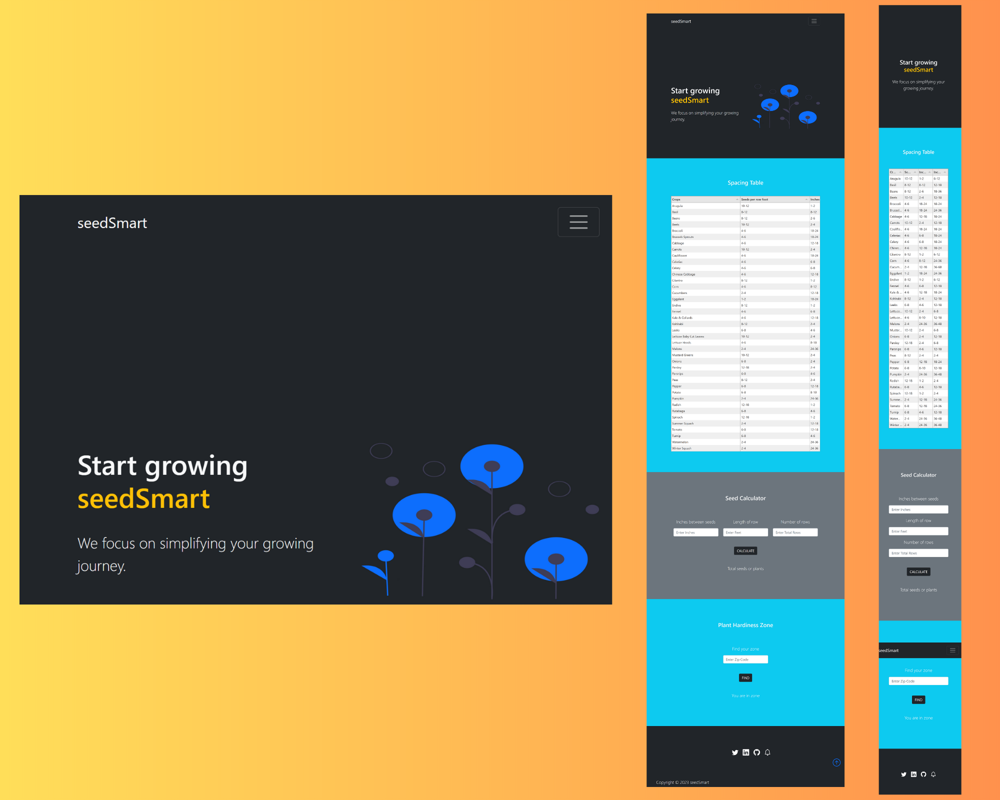

## seedSmart web app

Helps growers calculate total seed and plant needs for the growing season. A table of seed and planting rate data, a calculator based on total row feet, and a plant hardiness zone finder based on zip code.

---

---

### Built With

- ![HTML]
- ![CSS]
- ![javascript]
- ![bootstrap]

[css]: https://img.shields.io/badge/css-1572B6?style=for-the-badge&logo=css3
[html]: https://img.shields.io/badge/html5-%23E34F26.svg?style=for-the-badge&logo=html5&logoColor=white
[javascript]: https://img.shields.io/badge/javascript-%23f7df1e.svg?style=for-the-badge&logo=javascript&logoColor=white
[bootstrap]: https://img.shields.io/badge/bootstrap-7952B3?style=for-the-badge&logo=bootstrap&logoColor=white
